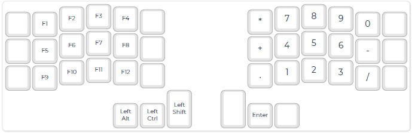

<!-- -*- mode: markdown; coding: utf-8 -*- -->

# Thinking about keyboard layouts

##### :TOC@3:
- [Thinking about keyboard layouts](#thinking-about-keyboard-layouts)
  - [Features I look for in a keyboard](#features-i-look-for-in-a-keyboard)
  - [Basic standard keyboard](#basic-standard-keyboard)
  - [Keyboard size to keep home position](#keyboard-size-to-keep-home-position)
    - [Staggered layout](#staggered-layout)
    - [Reasonable minimum size](#reasonable-minimum-size)
    - [Layering and modifiers (Compensation for size minimizing)](#layering-and-modifiers-compensation-for-size-minimizing)
  - [Basic layout design using Corne](#basic-layout-design-using-corne)
    - [Layer 0 (default)](#layer-0-default)
    - [Layer 1 (numbers, symbols and arrows)](#layer-1-numbers-symbols-and-arrows)
    - [Layer 2 (numeric pad and function keys)](#layer-2-numeric-pad-and-function-keys)
    - [Yet-unassigned keys](#yet-unassigned-keys)

## Features I look for in a keyboard

First of all, why did I want to use a Corne keyboard?
That's because I no longer want to use a keyboard with four rows.
Many modern keyboards are too large and require a lot of hand movement,
causing my hands to forget their home position and lead to more typos.
And the good thing about Corne keyboard is that we can customize the keymap with QMK!

Approximately 70% of my keyboard input consists of Japanese text,
followed by programming, Linux-based command operations, and data processing.

I spend a lot of time with emacs. Therefore, the position of the Ctrl key is very important.
And I've been using SKK in order to input Japanese for more than a few decades.
SKK, like many other Japanese input engines, uses the space key to instruct conversion.
In addition to this,
SKK uses the Shift key frequently to indicate the separation
between kanji and okurikana by capitalization.

Additionally, I sometimes use CAD-like software.
Many of these require many key combinations.
Traditional software recognizes so-called character codes (such as ASCII codes),
but modern software recognizes keyboard codes.
For example, it identifies numeric keypad "0" instead of just the character "0".
Therefore, a keyboard that can also send these key codes is required.

## Basic standard keyboard

I think the most standard keyboard is US 104 keyboard.

It consists of:
- 26 alphabetic keys,
- 10 numeric keys with symbols (excluding numeric pad keys),
- 11 symbol keys without numbers,
- 5 controll keys (escape, tab, space, back_space and return),
- 12 function keys,
- 17 numeric pad keys (0, ...,9, +, -, *, /, dot, enter and num_lock),
- 4 arrows,
- 6 edit support keys (insert, delete, home, end, pgup and pgdn),
- 3 system keys (print_screen, scroll_lock and pause),
- 7 modifier keys (caps_lock, left and right of shift, ctrl and alt), and
- 3 special keys (right and left of OS key (a.k.a. Windows key) and menu).

The keyboard without the last item is known as US 101.

Of course, it would be nice to be able to send out all 104 key codes,
but in most cases,
the following four modifier keys exist on the left and right sides,
and there is no problem if only one of them is used:

- Shift,
- Ctrl,
- Alt, and
- OS (Windows).

In the end, we only need to define 100 keys.

## Keyboard size to keep home position

Place you the four fingers of left hand on "A", "S", "D" and "F",
and the four fingers of right hand on "J", "K", "L" and ";".
The keys that can be pressed without moving your hands
are generally in the area shown in the figure below:

Of course, people's hands vary in size, so the area covered will also vary.
But, don't you think that there are many keys that are not within
the above area even though they are frequently used?
Even Enter key and Back-space key can not be typed without moving the right hand.
This applies even to compact keyboards that do not have function keys or numeric keys.
More small size keyboard is required in order to keep our hands home position.

### Staggered layout

Have you ever found it difficult to type the "6" key?
In most cases, the "6" key is closer to your left index finger,
so it should be easier to use that. However, we are generally taught to use their right hand
(these days, many people seem to be used to typing "6" using the index finger of their left hand).
Horizontal staggered layout causes this absurd situation.

Additionally, the horizontal staggered layout is thought to make a mistake of the fingers
used to press the top row keys such as "^", "&" and "*" (attention to be not a digit).

Since old typewriters had a hammer mechanism, each key lever part had to be slightly shifted.
So, it was horizontally staggered.
However, I think that very few people use typewriters these days.
If there is no need to use a typewriter,
there is no need for the keyboard to have a typewriter-like staggered layout.

### Reasonable minimum size

Basic requirements for minimizing hands moving are:
- 3 rows and 10 columns main character keys area (no numeric row),
- non horizontaly staggered layout, and
- some support keys can be located at both side ends and bottom.

The image is as bellow:

### Layering and modifiers (Compensation for size minimizing)

Naturally, less hand movement means fewer keys.
Therefore, in order to generate the necessary key code,
it is necessary to assign multiple key codes to one key and switch between them.
A key is also required for switching.

The number of key codes that need to be generated is 100,
and the number of keys that can be assigned to key codes is 30 plus α,
so at least 3 layers are required.
It must be possible to generate key codes by adding the modifier keys
that the keyboard inherently has (Shift, Control, Alt, and OS) to these.

As a result,
complex operations such as pressing multiple keys simultaneously may be required.
I'll take full advantage of QMK's capabilities
in order to support complex layering and modifying operations.

And let our thumbs play a bigger role.

## Basic layout design using Corne

The Corne keyboard is the best choice of keeping our hands at home position, I think.
All keys have natural finger assignments,
allowing you to hit all keys with minimal fingering motion.

The basic rules on designing are:
- assign keycodes instead of character codes,
- all common keys have to be located in the area of 3 x 10 as possible,
- all common keycodes can be modified by Shift, Control, Alt and these combinations, and,
- no problems with Japanese input, English input or programming for use.

The best design I think looks like below.

### Layer 0 (default)

There are 30 keys that can be used to enter characters.
If we use the 26 letters of the alphabet, there are only four letters left.
What is important is what character keys are assigned to these remaining four.

I don't think anyone who inputs Japanese will have any doubts about the "-" key remaining.
It is also useful for typing "_" when programming.
The "/" key is a little special.
That will be understandable to SKK users,
but many may prefer a different key. However,
it also allows for path input, which is indispensable to me. :-)

Note: I assign the SKK on/off key to Shift + Space.

### Layer 1 (numbers, symbols and arrows)

All other keys for printable characters are in this map.
There are 47 keys including the layer 0 character keys.
And also it has cursor navigation keys in this layer.
Almost keyboard inputs would be done by using layer 0 and layer 1.

### Layer 2 (numeric pad and function keys)

Since the numeric pad keys have own keycode, we have to allocate them and the remaining function keys.
Here, "Enter" key is the one of the pad keys.
Needless to say, it has the defferent key code from normal "Enter" key.

### Yet-unassigned keys

The unassigned keys of the 104 keyboard are:

- OS key,
- insert,
- menu,
- num_lock,
- caps_lock,
- scroll_lock,
- print_screen, and
- pause.

And we need the some key to switch to layer2.
These must be allocated to appropriate empty positions depending on the frequency of use.

[back](../readme.md)
