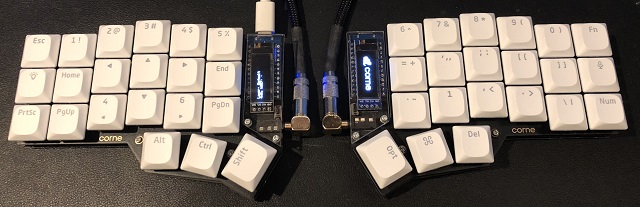

<!-- -*- mode: markdown; coding: utf-8 -*- -->

# Keymap laboratory using Corne keyboard

This site contains that the trials in order to create special keymaps
to minimize moving the hands using Corne Keyboard, which is the cute
42 keys vertically staggered keyboard.

See: [Foostan's Corne keyboard](https://github.com/foostan/crkbd/)

My goals are:

- Can generate all keycodes defined on US 104 keyboard,
- Japanese input using SKK can be easily done, and
- Friendly to use with Emacs.

### How keymap generation works

I'm using [QMK Firmware](https://docs.qmk.fm/),
and the firmware with special keymap is created
according to the instructions on that web pages.
Visit the page
[Building QMK with GitHub Userspace](https://docs.qmk.fm/#/newbs_building_firmware_workflow?id=building-qmk-with-github-userspace)
for more detailed description.

### How to see my latest keymap

You can use the site [QMK Configurator](https://config.qmk.fm/#/crkbd/rev1/LAYOUT_split_3x6_3)
with my [kitcnya.json](https://raw.githubusercontent.com/kitcnya/crkbd/master/kitcnya.json) file.
And [the PDF version of QMK Configurator print](kitcnya.pdf) is also available.
Since latest keymap has many convenience feature for me,
[the essential version of it](essential.pdf) has been provided.

## Contents

- [Thinking about keyboard layouts](docs/keyboard.md)
  - [Features I look for in a keyboard](docs/keyboard.md#features-i-look-for-in-a-keyboard)
  - [Basic standard keyboard](docs/keyboard.md#basic-standard-keyboard)
  - [Keyboard size to keep home position](docs/keyboard.md#keyboard-size-to-keep-home-position)
  - [Basic layout design using Corne](docs/keyboard.md#basic-layout-design-using-corne)
