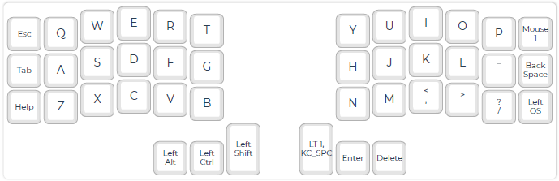

<!-- -*- mode: markdown; coding: utf-8 -*- -->

# Keymap Laboratory Using Corne Keyboard

This site contains that the trials in order to create special keymaps
to minimize moving the hands using Corne Keyboard, which is the cute
42 keys vertically staggered keyboard.

See: [Foostan's Corne keyboard](https://github.com/foostan/crkbd/)

My goals are:

- Can generate all keycodes defined on US 104 keyboard,
- Japanese input using SKK can be easily done, and
- Friendly to use with Emacs.

## How keymap generation works

I'm using [QMK Firmware](https://docs.qmk.fm/),
and the firmware with special keymap is created
according to the instructions on that web pages.
Visit the page
[Building QMK with GitHub Userspace](https://docs.qmk.fm/#/newbs_building_firmware_workflow?id=building-qmk-with-github-userspace)
for more detailed description.

## How to see my keymap

You can use the site [QMK Configurator](https://config.qmk.fm/#/crkbd/rev1/LAYOUT_split_3x6_3)
with my *.json file.

## Current keyboard layouts

First of all, why did I want to use a Corne keyboard?
That's because I no longer want to use a keyboard with four rows.
Many modern keyboards are too large and require a lot of hand movement,
causing my hands to forget their home position and lead to more typos.
And the good thing about Corne keyboard is that we can customize the keymap with QMK!

Approximately 70% of my keyboard input consists of Japanese text,
followed by programming, Linux-based command operations, and data processing.

I spend a lot of time with emacs. Therefore, the position of the Ctrl key is very important.
And I've been using SKK in order to input Japanese for more than a few decades.
SKK, like many other Japanese input engines, uses the space key to instruct conversion.
In addition to this,
SKK uses the Shift key frequently to indicate the separation
between kanji and okurikana by capitalization.

### Default Map (Layer 0)

Since I want to minimize the movement of my pinkies during normal input,
I generally place the character keys within 5 columns.
I have selected keys that are essential for programming (including English input)
and Japanese input.
There are 30 keys that can be used to enter characters.
If we use the 26 letters of the alphabet, there are only 4 letters left.
What is important is what character keys are assigned to these remaining four.

### Alternative Default Map (Layer 1)

This is for entering numbers quickly like using number keypad.

### Supplemental Map (Layer 2)

### Shifted Supplemental Map (Layer 3)

