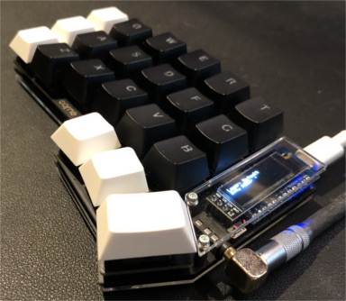
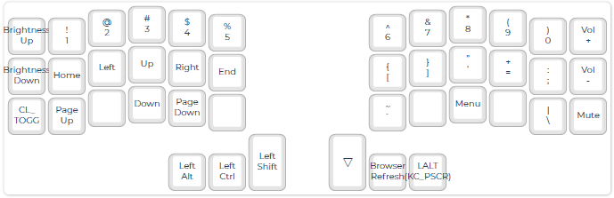
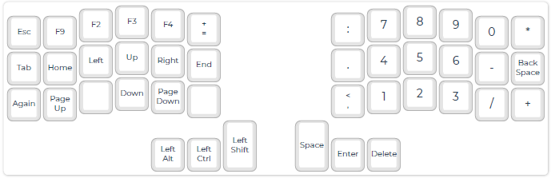
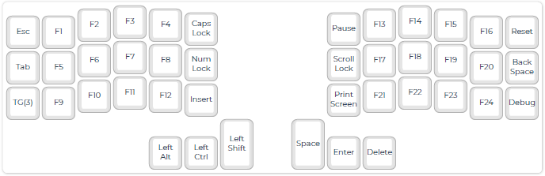

<!-- -*- mode: markdown; coding: utf-8 -*- -->

# Keymap laboratory using Corne keyboard

This site contains that the trials in order to create special keymaps
to minimize moving the hands using Corne Keyboard, which is the cute
42 keys vertically staggered keyboard.

See: [Foostan's Corne keyboard](https://github.com/foostan/crkbd/)

My goals are:

- Can generate all keycodes defined on US 104 keyboard,
- Japanese input using SKK can be easily done, and
- Friendly to use with Emacs.

## How keymap generation works

I'm using [QMK Firmware](https://docs.qmk.fm/),
and the firmware with special keymap is created
according to the instructions on that web pages.
Visit the page
[Building QMK with GitHub Userspace](https://docs.qmk.fm/#/newbs_building_firmware_workflow?id=building-qmk-with-github-userspace)
for more detailed description.

## How to see my keymap

You can use the site [QMK Configurator](https://config.qmk.fm/#/crkbd/rev1/LAYOUT_split_3x6_3)
with my [kitcnya.json](https://raw.githubusercontent.com/kitcnya/crkbd/master/kitcnya.json) file.

## Features I look for in a keyboard

First of all, why did I want to use a Corne keyboard?
That's because I no longer want to use a keyboard with four rows.
Many modern keyboards are too large and require a lot of hand movement,
causing my hands to forget their home position and lead to more typos.
And the good thing about Corne keyboard is that we can customize the keymap with QMK!

Approximately 70% of my keyboard input consists of Japanese text,
followed by programming, Linux-based command operations, and data processing.

I spend a lot of time with emacs. Therefore, the position of the Ctrl key is very important.
And I've been using SKK in order to input Japanese for more than a few decades.
SKK, like many other Japanese input engines, uses the space key to instruct conversion.
In addition to this,
SKK uses the Shift key frequently to indicate the separation
between kanji and okurikana by capitalization.

Additionally, I sometimes use CAD-like software.
Many of these require many key combinations.
Traditional software recognizes so-called character codes (such as ASCII codes),
but modern software recognizes keyboard codes.
For example, it identifies numeric keypad "0" instead of just the character "0".
Therefore, a keyboard that can also send these key codes is required.

## Basic standard keyboard

I think the most standard keyboard is US 104 keyboard.

It consists of:
- 26 alphabetic characters,
- 10 numeric characters with symbols,
- 11 symbols with symbols,
- 5 controll keys (escape, tab, space, back_space and return),
- 12 function keys,
- 17 numeric pad keys (0, ...,9, +, -, *, /, dot, enter and num_lock),
- 4 arrows,
- 6 edit support keys (insert, delete, home, end, pgup and pgdn),
- 3 system keys (print_screen, scroll_lock and pause),
- 7 modifier keys (caps_lock, left and right of shift, ctrl and alt), and
- 3 special keys (right and left of OS key (a.k.a. Windows key) and menu).

The keyboard without the last item is known as US 101.

Of course, it would be nice to be able to send out all 104 key codes,
but in most cases,
the following four modifier keys exist on the left and right sides,
and there is no problem if only one of them is used:

- Shift,
- Ctrl,
- Alt, and
- OS (Windows).

In the end, we only need to define 100 keys.

## Current keyboard layouts

### Default map (Layer 0)

Since I want to minimize the movement of my pinkies during normal input,
I generally place the character keys within 5 columns.
I have selected keys that are essential for programming (including English input)
and Japanese input.
There are 30 keys that can be used to enter characters.
If we use the 26 letters of the alphabet, there are only four letters left.
What is important is what character keys are assigned to these remaining four.

I don't think anyone who inputs Japanese will have any doubts about the "-" key remaining.
It is also useful for typing "_" when programming.
The "/" key is a little special.
That will be understandable to SKK users,
but many may prefer a different key. However,
it also allows for path input, which is indispensable to me. :-)

Note: SKK on/off key for me is Shift + Space.

### Supplemental map (Layer 1)

All other keys for printable characters are in this map.
There are 47 keys including the layer 0 character keys.

### Alternative map (Layer 2)

This is for entering numbers quickly like using number keypad.
F9 key is not wrong! It is used in Excel.
I'm still at a loss as to which keys to include and where to place them.

From Layer 0, TT(2) allows this map enabled momentally or alternatively.

### Function key map (Layer 3)

